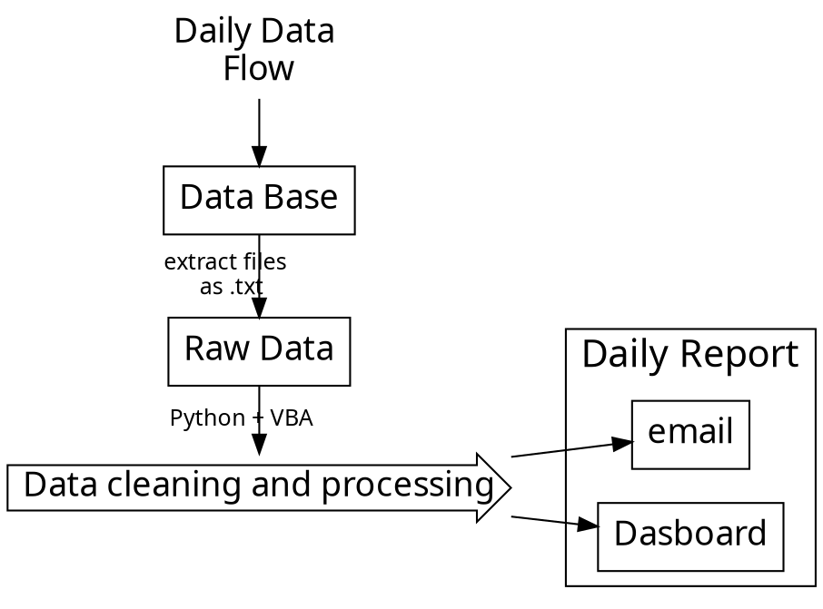

# Projects & Achievements


## Table of Content :books: 
- Let's talk Data Science
    - Flight delay forecast
    - What's the next hit song?

- Teachings
    - Why is Machine Learning fun
    - Make people love Data

- My journey at MBCME
    - Automation & Optimisation
    - Data Analytics


---

## Who am I?👩‍🔬👩‍🏫🧗‍♀️

- Graduated from Business and Engineering Schools
- Data Scientist
- Sports Lover

---

## Let's talk Data Science.

### Helicopters Data Scientist :helicopter: 

<div align = "center">


<br>


</div>

---

### Flight delay predictions :airplane: 

<br>

:::info
Business case: How to forecast flight's delay? ⏰
:::


<br>
<br>

**A regression problem:**

- 🎯 **Objective**: Predict the arrival delay

- 📋 **Dataset**: 5 million rows - 65 features
- 🔎 **Cleaning & processing**: Temporal, Geographical, categorical, numerical data
- 🤖 **Modeling**: Linear Regression, Ridge/Lasso, Boosting methods
- 📈 **Results:** :deciduous_tree:   9 min prediction error


<br>

```typescript
// Create a user-friendly app with Flask
from modele import predict_vol, aero
from flask import Flask, render_template, request
app = Flask(__name__)
```

:::info
Check project:
https://github.com/MarineJL/Flight-Delay

Check app:
https://projet4-marine.herokuapp.com
:::

***

### What's the next hit song? :notes: 


<br>

:::info
Business case: How to predict the hit potential of a song? :musical_score: 
:::


<br>
<br>

**A classification problem:**

- 🎯 **Objective**: Predict the hit potential of a song
- 📋 **Dataset**: Built with Spotify API
- 🤖 **Modeling**: Logistic, Penalized regression, Boosting methods
  
- 📈 **Results:** Type I error & Power of Marketing :moneybag:

<br>

<center>

|   |   Not a hit |    Hit      |  Class error |
|----------|:----------:|:-------------:|------:|
| **Not a hit** |  29 | 60 |0.674
| **Hit** |    21   |   129 |0.078

**Confusion Matrix**

</center>

<br>

:::info
Check tutorial:
https://github.com/MarineJL/Spotify_Data

Check thesis:
https://github.com/MarineJL/MasterThesis
:::
---
## Teachings 👩‍🏫
 
### Why Machine Learning is fun 

<br>

:::danger
🚨 Sensitive topic coming
:::
:::info
Check Viz :soccer: : https://public.tableau.com/profile/marine.jl#!/vizhome/Datavizfifa2/Tableaudebord1
:::

<br>

### How to make people love data


How to predict John Snow's death?
<br>

<p align='center'></p>
<p align='center'></p>


---

## My journey at Mercedes-Benz Cars Middle East.

### Automation & Optimisation

#### Before Automation

<p align='center'></p>

<br>

#### A new process



#### After Automation
<p align='center'></p>


***

### Data Analytics

:::warning
:warning:  For confidentiality concerns figures have been modified.
:::


***

***

***


---


<br>


### Thank you! :rocket: 


