# A. General Questions

- [Question 1](#Question-1)
- [Question 2](#Question-2)
- [Question 3](#Question-3)
- [Question 4](#Question-4)
- [Question 5](#Question-5)

***

## Question 1

> 1. Sketch possible connections between pure mathematics and artificial neural networks.

### The biological model
Artificial Neuronal Networks are mathematical models inspired by the biology itself. The perceptron (the artifical neurone) replicates the biological neurone functioning.

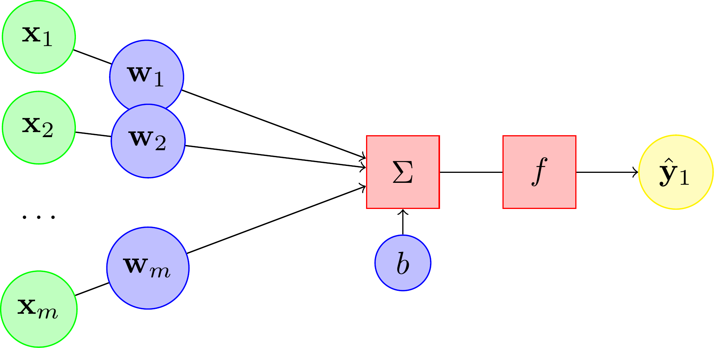

Here are the following entities:
- input xi ( = the dendrites)
- output y ( = the axon)
- parameters (wi weights and b biais) influencing the neurone

The neuronal network is built by adding layers. The output of a layer is the input of the followig one. 

### The mathematical form of the output of its neurons

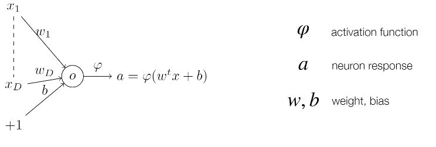

The last layer computes the final probabilities with an activation function. This function is the logistic function for binary classification, and softmax for multi-classes classification.

### Learning with the perceptron: Gradient Descent Learning

#### Problem Statement

Given a pairs of input-output data xi, ti, find w such that:

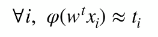

The neuronal learning is done by optimizing a loss function. The objective is to find the wi and b that minimize the loss function. The loss function is often the cross-entropy, for a classification problem.

#### Use Gradient Descent 

- Pick up a differentiable loss function to be minimized
- Apply gradient descent. The weights are then updated iteratively. 

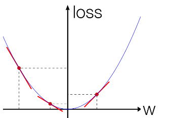

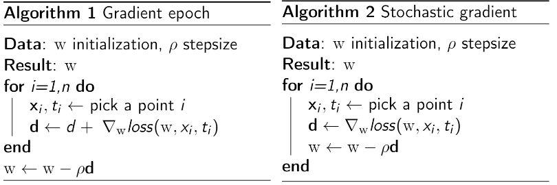

NB: in real condition, the learning rate has to be carefully set. A too small learning rate makes the computation time too slow, a too large rate make it impossible to find the global minimum. Local minimum and plateau, can also lead to standard pitfalls. Optimization is done by using a stochastic gradient descent.

### The Universal Approximation Theorem

In 1989, Cybenko proved the following: 
Under reasonable assumptions on the activation function to be used, for any continuous function on a compact g and any precision threshold e:
There exists a 1-hidden-layer MLP with a finite number of neurons that can approximate g at level e.

In other terms, simple neural networks can represent a wide variety of interesting functions when given appropriate parameters.

Adding layers and thus create multilayers perceptron (MLP) is useful to modelize complex problems. This is the so-called deep learning.
MLP learn iteratively, with back-propagation (which  requires the derivatives of activation functions).

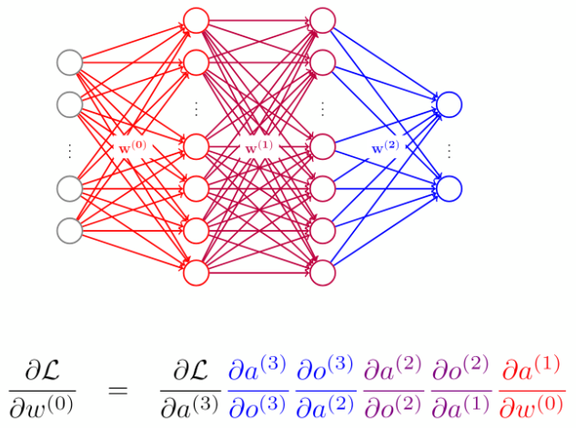

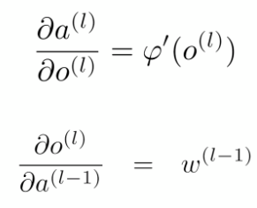

***

## Question 2

> 2. Give examples of common loss functions that are used to train machine learning models. Describe for which tasks each loss function is particularly well-suited.

The loss function learns to reduce the error in prediction. It a method of evaluating how well your algorithm models a dataset, by computing the cost of an event.
We can distinguish cost function associated to regression, and classification problems. 

### Regression

The output is a numerial value. For example, if you want to predict car sales prices, temperatures forecast etc. the following loss function may particularly be adapted. 
#### MSE, L2 loss

For each x in the testing set, the distance between the actual value and the prediction is computed. Those distances are then summed (this is the RSS Residual Sum of Squares) and normalized. 

NB: To get the result in the same unit as the target y, the RMSE (sqrt(MSE)) can be computed.

This metric is very sensitive when the values differ by several orders of magnitude. To get rid of this, we can take the log of actual and predicted value before computing the RMSE.

#### MAE, L1 loss

In case the training data is corrupted with outliers, the best option is to compute the Mean Absolute Error (sum of absolute differences between target and predicted variables).

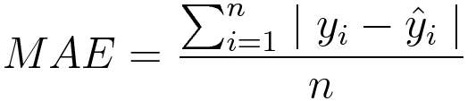

The MSE squares the error and thus gives higher weigths to outliers. 

#### RSE

Sometimes, the RMSE can be hard to interpret, especially when the orders of magnitude are unknown. 
We can then choose to compute the correlation between the actual and predicted value, with the RSE (Relative Squared Error).

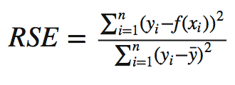

NB: R2 = 1 - RSE is often encountered. This is the coefficient of determination (squared Pearson correlation), a measure of the correlation between actual and predicted values.

### Classification

The output value is categorical. The following loss functions are adapted for classification problems (Churn prediction, Cancer detection, images classification etc.)
Many classification models output numerical values, that can be interpreted as the probability that the point is in the positive class. In this case, a threshold has to be fixed.

#### Cross Entropy, Log loss

Cross-entropy loss, or log loss, measures the performance of a classification model whose output is a probability value between 0 and 1. Cross-entropy loss increases as the predicted probability diverges from the actual label.

Log loss decreases as the predicted probability approaches 1. 

#### Confusion Matrix

In supervised learning, the confusion matrix assess the quality of classification model, whatever the number of classes. 
From this matrix, other metrics can be comptuted, such as the recall or the precision, which are measures of relevance. 

#### ROC/AUC Curve to vizualise the performance of a classification model

As seen the in above section, Sensitivity and Specificity are inversely proportional to each other.
The receiver operating characteristic (ROC) curve is a graphical representation of the true positive rate (the sensitivity) as a function of the false positive rate (the so called false alarm rate, computed as FP/(FP + TN)). A perfect classifier, with a 100% true positive rate and no false positives, would be represented by a (0,1) coordinate.
An indicator related to the ROC curve is the area under the curve (AUC), that is equal to 1 for a perfect classifier and to 0.5 for a random guess. The higher the AUC the better the model.

Below example is the result obtained while working for my Master Thesis project: How to predict the hit potential of a song?

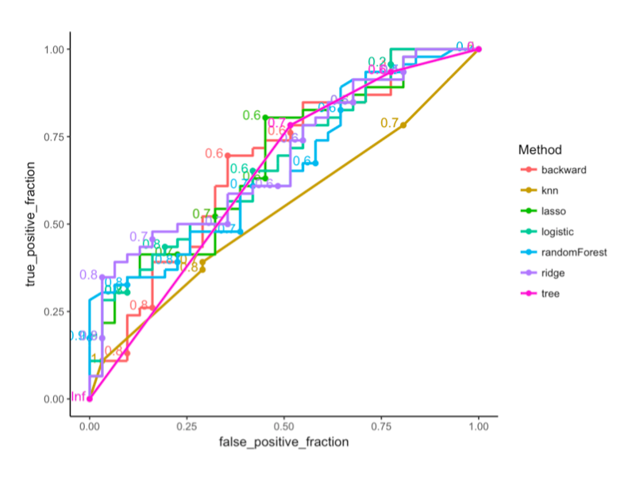

The graph displays the performance of each tested algorithm of a binary classification problem.

***

## Question 3

> 3. A machine learning model is trained on a single node host machine with a single GPU. The model is optimised by a stochastic gradient descend variant. What key properties of the dataset, the model and the optimisation method must be considered when evaluating the memory requirements on the host machine and its GPU?

The stochastic gradient descent (SGD) approach is iterative and widely used to train deep learning models. Contrary to the Gradient Descent (described in question 1), SGD calculates errors and updates weights for each training samples (or each mini batch).
With the increasing model updates comes a higher computational time.
Thus, the **size of the dataset** will be a parameter to be taken into account (input dimension).
 
At the model level, one can play on the number of **epochs** (how many times one pass over the entire dataset), **batch size** (number of samples), and **validation split** to optimize the computation.
The size of the mini-batches has a significant impact on the learning process, and is a parameter limited by the size of the GPU.
Other hyper-parameters can be set to change the optimizer, with **momentum** (takes past gradients into account to smooth out the steps of gradient descent) and adaptive **learning rate**.
 
***
## Question 4

> 4. Describe advantages and challenges when deploying a professional software solution in a cloud environment. What are the alternatives to cloud deployment?

Here are some examples of the main advantages of cloud deployment:
-   The whole infrastructure is owned, managed and monitored by the cloud provider. There is no need for a physical server, human resources, knowledge etc. The cloud provider takes care of the whole chain and backend infrastructure.
-   A cloud-based approach enable a scalable environment. You pay for what you actually use, and your environment evolves alongside your needs.
-   The client can easily choose the type of deployment strategy (ie. canary, blue-green etc.)
-   The infrastructure can be spread on multiple regions (to reduce the travel ping, increase the performance on the server etc.)
-   Resilient to failure
 
Outages and downtimes, security issues (especially when dealing with sensitive business data), are the main challenges when opting for a cloud-based solution. To sum up, cloud deployment is cost-saving, it increases scalability and reliability, and faster applications deployment cycles.
 
An alternative to cloud deployment is bare metal (On-Premises Infrastructure). This means that you on your own server and manage everything. This is very costly, as there is a need for knowledge, software, hardware, physical in-house storage capacities with power and air conditioning, human resources, application requirements etc.

***
## Question 5

> 5. What are the main building blocks of a modern DevOps workflow in terms of tools and processes?

More than a job, DevOps is a culture and a framework. This is a fusion between software development and operations, aiming at fostering communication, collaboration and cohesion among Dev and Ops teams. At the top of that, the objective is reaching efficiency in continuous integration and deployment, while leaning on an agile mindset.
 
The following picture shows the different steps of a DevOps workflow.

Plan, code, build and test are the Dev part of the workflow.
Release (code pushed in a registry), deploy, operate and monitor are on the Ops side.
 
In term of tools, the DevOps framework is based on different tools at each step:
-   Management tools like Trello, LucidChart
-   Referential like GitHub to store and control code versions
-   Indexing tools like Splunk
-   Monitoring tools to check the modifications, like Nagios
Additionally, there are obviously the usual script languages like PHP and JavaScript.

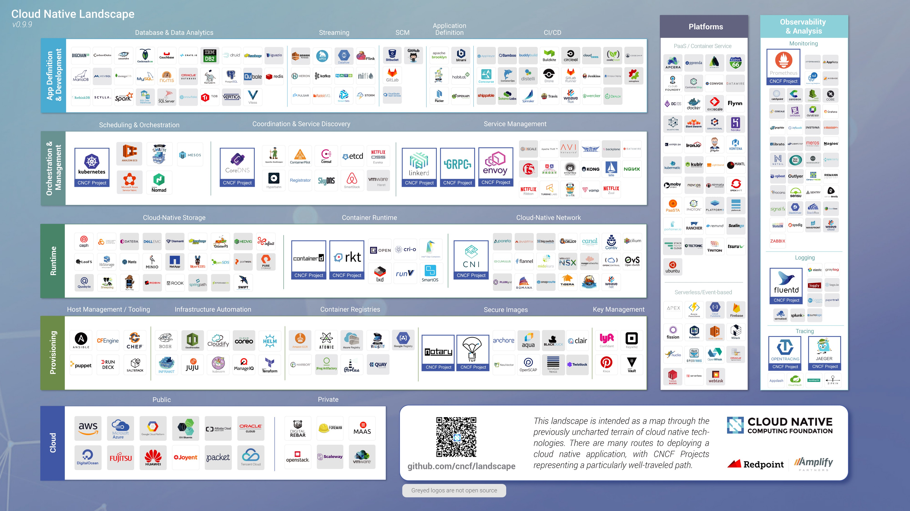

