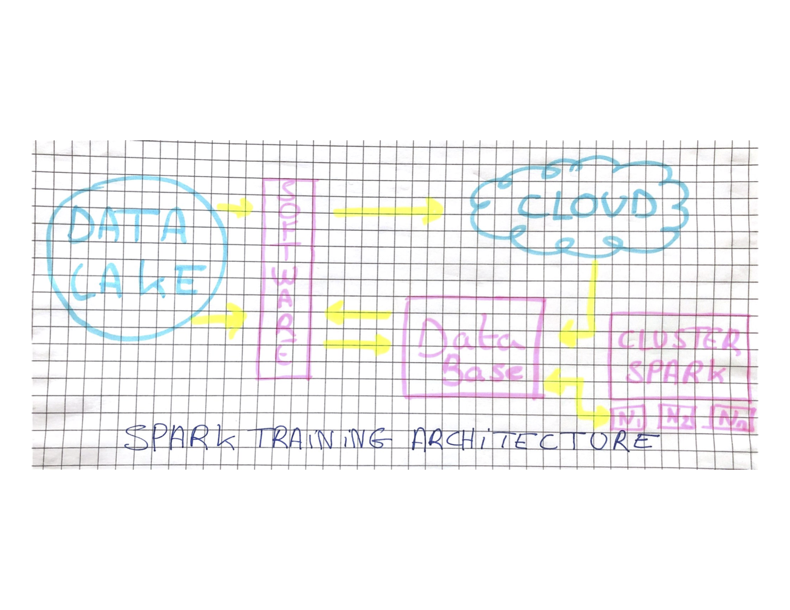

# C. Data & Analytics workbench

> Think about a team that includes a group of actively developing data scientists, with a portfolio of professionalised customer software solutions and the regular need to host interactive training sessions for a varying group of users. Design an infrastructure that can host all such scenarios, given currently available technology. How would you deploy software on your suggested data platform?

## Prerequisites & Assumptions
Before sharing with you the solution, I wanted as a prerequisite, to write you down what I understood about the task. 
When I read the question, 2 different architectures came out of the question because of 2 activities really different 
- "training sessions for a varying group of users" 
Which is an activity of trainer which requires to pop environements on the fly where you can benchmark tools/concepts/architectures
- "actively developing data scientists, with a portfolio of professionalised customer software solutions" 
Which is a classic activity of software development.

So the reponse will be split in 2 parts, both tackling the points above.

## Response 

#### 1. "training sessions for a varying group of users"

To answer this question, I will assume that the objective is to deliver a training on Spark for a group of users. To do so, the users have to access both data and environment to practice.

In order to train people, you need to be able to spin up environments where they can try/learn the technology. In order to do that, you need tools that are used in CI/CD, a software that is able to interact with your cloud provider and spin and configure environement on the fly, we could use Jenkins for instance (Have a job that spins up a spark node for example). On top of that you need Data as a training dataset, to tackle that you can still use Jenkins that will start an instance configure the datastorage/db, seed a fresh dataset (from kaggle or a private datalake). After doing that the consultant will be able to train/demo/hands off the specific technology to Its clients. (See sketch below)

#### 2. "actively developing data scientists, with a portfolio of professionalised customer software solutions" 

This is a simple 8 steps DevOps workflow: 

- Plan 

Plan the next changes, improvement, bugfixes you're going to tackle in your next sprint/week. 
Tools you can use: Jira in order to planify your sprints and work with Agile methods
- Code 

Execute the prepared plan by coding the solution.
Tools you can use: Your favorite IDE
- Build

Build the solution to transform the code in a binary/executable/library .. in order to make it executable and freeze it from any change.
Tools you can use: CI solution like Jenkins/Gitlab-ci/Travis that will spin a build environment.
- Test

Test the freshly built solution.
Tools you can use: CI solution like Jenkins/Gitlab-ci/Travis that will test the built solution 
- Release

When tests are succesful, you can officialy release it, which means pushing it to your favorite artifactory and freeze the version of the release.
Tools you can use: an artifactory in order to push the release to it (aptly/nexus/jfrog) 
- Deploy

Deploy the realase to your differents environment (staging/ production..)
Tools you can use: CD tools like spinnaker/jenkins/gitlab-ci
You can also couple it with a configuration manager like puppet/ansible/chef
- Operate

Operate your platform in order to keep it running like a charm. (no matters if you have 100 client or a billion)
Tools you can use: An orchestrator, in order to deal with scalability and easy deployments
- Monitor

Monitor your platform in order to see/correct/anticipate every problem (fan overheating, new release more costly in CPU)
Tools you can use: Datadog/prometheus/flume/grafana
