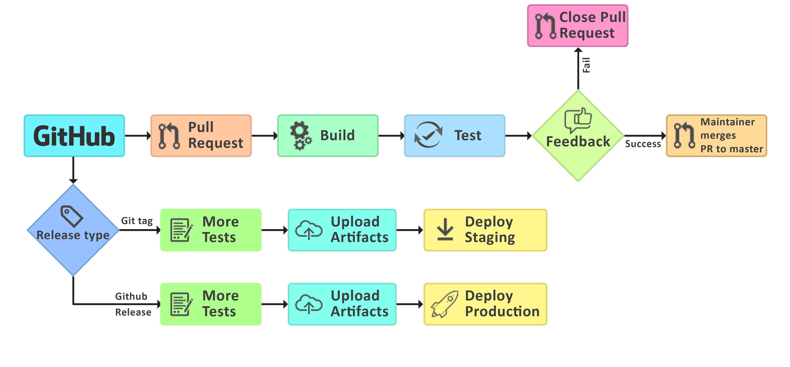

# C. Data & Analytics workbench

> Think about a team that includes a group of actively developing data scientists, with a portfolio of professionalised customer software solutions and the regular need to host in- teractive training sessions for a varying group of users. Design an infrastructure that can host all such scenarios, given currently available technology. How would you deploy software on your suggested data platform?

To answer this question, I will assume that the objective is to deliver a training on Spark for a group of users. To do so, the users have to access both data and environment to practice.
The idea is to build a data lack to centralize all the data and link it to a software that will collect needed data. This software communicates with a cloud provider and machines that create nodes accessible on Spark, connected to a database. Such architecture enables any user to connect to the nodes from Hadoop cluster. (See sketch below)

